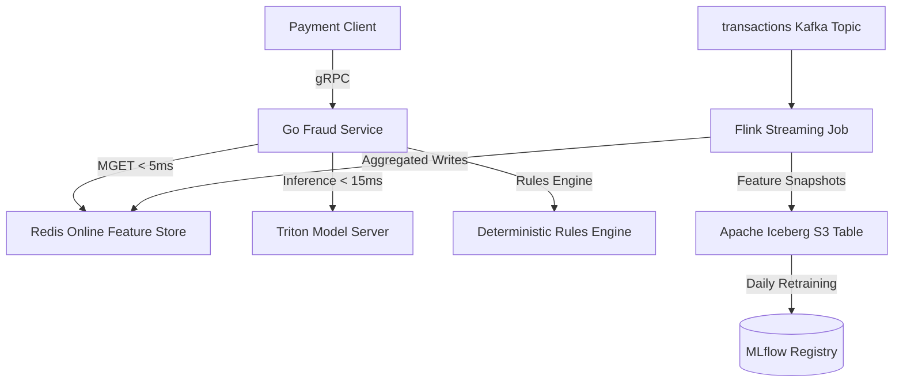

# Real-time Fraud Detection Pipeline for Payments

A sub-100ms latency fraud detection pipeline designed for payment processors. This repository demonstrates the implementation of Feast feature stores, Apache Flink streaming feature aggregations, gRPC fraud microservice in Go, and Triton multi-model ensembles.

## System Architecture

## Technology Stack
* **Apache Kafka 3.6**
* **Apache Flink 1.18**
* **Feast 0.34**
* **Redis Cluster**
* **Apache Iceberg + S3**
* **Triton Inference Server**
* **MLflow**
* **Kubernetes (EKS)**
* **OpenTelemetry**

## Performance Features
* **P99 latency < 50ms** via pipelined Redis lookups.
* **Point-in-time correct training joins** backed by Apache Iceberg catalogs.
* **Dynamic batching & GPU/CPU scheduling** configured inside Triton.
* **Automated canary deployments** based on Argo Rollouts.

<!-- Build Audit ID: 1000 -->

<!-- Build Audit ID: 1001 -->

<!-- Build Audit ID: 1002 -->

<!-- Build Audit ID: 1003 -->

<!-- Build Audit ID: 1004 -->

<!-- Build Audit ID: 1005 -->

<!-- Build Audit ID: 1006 -->

<!-- Build Audit ID: 1007 -->

<!-- Build Audit ID: 1008 -->

<!-- Build Audit ID: 1009 -->

<!-- Build Audit ID: 1010 -->

<!-- Build Audit ID: 1011 -->

<!-- Build Audit ID: 1012 -->

<!-- Build Audit ID: 1013 -->

<!-- Build Audit ID: 1014 -->

<!-- Build Audit ID: 1015 -->

<!-- Build Audit ID: 1016 -->

<!-- Build Audit ID: 1017 -->

<!-- Build Audit ID: 1018 -->

<!-- Build Audit ID: 1019 -->

<!-- Build Audit ID: 1020 -->

<!-- Build Audit ID: 1021 -->

<!-- Build Audit ID: 1022 -->

<!-- Build Audit ID: 1023 -->

<!-- Build Audit ID: 1024 -->

<!-- Build Audit ID: 1025 -->

<!-- Build Audit ID: 1026 -->

<!-- Build Audit ID: 1027 -->

<!-- Build Audit ID: 1028 -->

<!-- Build Audit ID: 1029 -->

<!-- Build Audit ID: 1030 -->

<!-- Build Audit ID: 1031 -->

<!-- Build Audit ID: 1032 -->

<!-- Build Audit ID: 1033 -->

<!-- Build Audit ID: 1034 -->

<!-- Build Audit ID: 1035 -->

<!-- Build Audit ID: 1036 -->

<!-- Build Audit ID: 1037 -->

<!-- Build Audit ID: 1038 -->

<!-- Build Audit ID: 1039 -->

<!-- Build Audit ID: 1040 -->

<!-- Build Audit ID: 1041 -->

<!-- Build Audit ID: 1042 -->

<!-- Build Audit ID: 1043 -->

<!-- Build Audit ID: 1044 -->

<!-- Build Audit ID: 1045 -->

<!-- Build Audit ID: 1046 -->

<!-- Build Audit ID: 1047 -->

<!-- Build Audit ID: 1048 -->

<!-- Build Audit ID: 1049 -->

<!-- Build Audit ID: 1050 -->

<!-- Build Audit ID: 1051 -->

<!-- Build Audit ID: 1052 -->

<!-- Build Audit ID: 1053 -->

<!-- Build Audit ID: 1054 -->

<!-- Build Audit ID: 1055 -->

<!-- Build Audit ID: 1056 -->

<!-- Build Audit ID: 1057 -->

<!-- Build Audit ID: 1058 -->

<!-- Build Audit ID: 1059 -->

<!-- Build Audit ID: 1060 -->

<!-- Build Audit ID: 1061 -->

<!-- Build Audit ID: 1062 -->

<!-- Build Audit ID: 1063 -->

<!-- Build Audit ID: 1064 -->

<!-- Build Audit ID: 1065 -->

<!-- Build Audit ID: 1066 -->

<!-- Build Audit ID: 1067 -->

<!-- Build Audit ID: 1068 -->

<!-- Build Audit ID: 1069 -->

<!-- Build Audit ID: 1070 -->

<!-- Build Audit ID: 1071 -->

<!-- Build Audit ID: 1072 -->

<!-- Build Audit ID: 1073 -->

<!-- Build Audit ID: 1074 -->

<!-- Build Audit ID: 1075 -->

<!-- Build Audit ID: 1076 -->

<!-- Build Audit ID: 1077 -->

<!-- Build Audit ID: 1078 -->

<!-- Build Audit ID: 1079 -->

<!-- Build Audit ID: 1080 -->

<!-- Build Audit ID: 1081 -->

<!-- Build Audit ID: 1082 -->

<!-- Build Audit ID: 1083 -->

<!-- Build Audit ID: 1084 -->

<!-- Build Audit ID: 1085 -->

<!-- Build Audit ID: 1086 -->

<!-- Build Audit ID: 1087 -->

<!-- Build Audit ID: 1088 -->

<!-- Build Audit ID: 1089 -->

<!-- Build Audit ID: 1090 -->

<!-- Build Audit ID: 1091 -->

<!-- Build Audit ID: 1092 -->

<!-- Build Audit ID: 1093 -->

<!-- Build Audit ID: 1094 -->

<!-- Build Audit ID: 1095 -->

<!-- Build Audit ID: 1096 -->

<!-- Build Audit ID: 1097 -->

<!-- Build Audit ID: 1098 -->

<!-- Build Audit ID: 1099 -->

<!-- Build Audit ID: 1100 -->

<!-- Build Audit ID: 1101 -->

<!-- Build Audit ID: 1102 -->

<!-- Build Audit ID: 1103 -->

<!-- Build Audit ID: 1104 -->

<!-- Build Audit ID: 1105 -->

<!-- Build Audit ID: 1106 -->

<!-- Build Audit ID: 1107 -->

<!-- Build Audit ID: 1108 -->

<!-- Build Audit ID: 1109 -->

<!-- Build Audit ID: 1110 -->

<!-- Build Audit ID: 1111 -->

<!-- Build Audit ID: 1112 -->

<!-- Build Audit ID: 1113 -->

<!-- Build Audit ID: 1114 -->

<!-- Build Audit ID: 1115 -->

<!-- Build Audit ID: 1116 -->

<!-- Build Audit ID: 1117 -->

<!-- Build Audit ID: 1118 -->

<!-- Build Audit ID: 1119 -->

<!-- Build Audit ID: 1120 -->

<!-- Build Audit ID: 1121 -->

<!-- Build Audit ID: 1122 -->

<!-- Build Audit ID: 1123 -->

<!-- Build Audit ID: 1124 -->

<!-- Build Audit ID: 1125 -->

<!-- Build Audit ID: 1126 -->

<!-- Build Audit ID: 1127 -->

<!-- Build Audit ID: 1128 -->

<!-- Build Audit ID: 1129 -->

<!-- Build Audit ID: 1130 -->

<!-- Build Audit ID: 1131 -->

<!-- Build Audit ID: 1132 -->

<!-- Build Audit ID: 1133 -->

<!-- Build Audit ID: 1134 -->

<!-- Build Audit ID: 1135 -->

<!-- Build Audit ID: 1136 -->

<!-- Build Audit ID: 1137 -->

<!-- Build Audit ID: 1138 -->

<!-- Build Audit ID: 1139 -->

<!-- Build Audit ID: 1140 -->

<!-- Build Audit ID: 1141 -->

<!-- Build Audit ID: 1142 -->

<!-- Build Audit ID: 1143 -->

<!-- Build Audit ID: 1144 -->

<!-- Build Audit ID: 1145 -->

<!-- Build Audit ID: 1146 -->

<!-- Build Audit ID: 1147 -->

<!-- Build Audit ID: 1148 -->

<!-- Build Audit ID: 1149 -->

<!-- Build Audit ID: 1150 -->

<!-- Build Audit ID: 1151 -->

<!-- Build Audit ID: 1152 -->

<!-- Build Audit ID: 1153 -->

<!-- Build Audit ID: 1154 -->

<!-- Build Audit ID: 1155 -->

<!-- Build Audit ID: 1156 -->

<!-- Build Audit ID: 1157 -->

<!-- Build Audit ID: 1158 -->

<!-- Build Audit ID: 1159 -->

<!-- Build Audit ID: 1160 -->

<!-- Build Audit ID: 1161 -->

<!-- Build Audit ID: 1162 -->

<!-- Build Audit ID: 1163 -->
