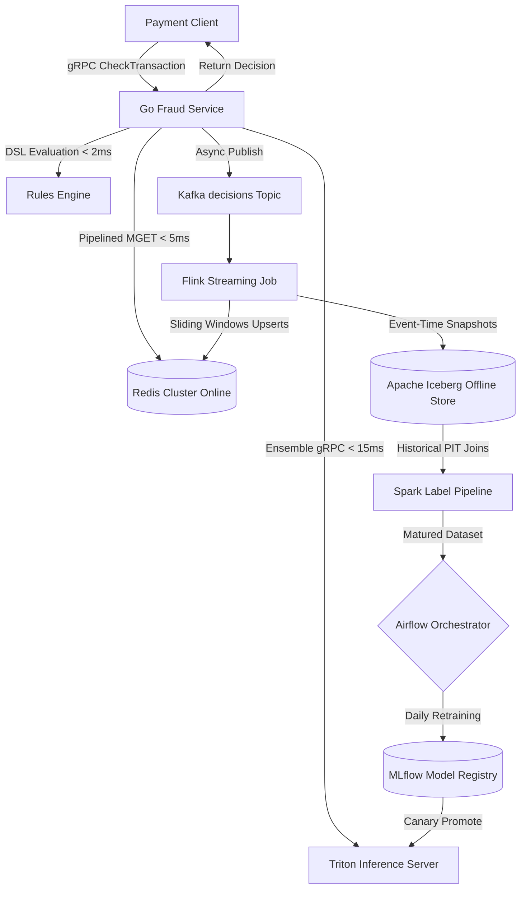

# Real-time Fraud Detection Pipeline for Payments

A production-grade, sub-100ms latency fraud detection pipeline designed for payments processors. This project illustrates the modern MLOps and Data Engineering paradigms required to compute streaming aggregates, host online/offline feature registries, orchestrate multi-model serving, and trigger automated retraining loops based on concept drift observability.

---

## 1. End-to-End System Architecture

The architecture is divided into two distinct processing planes:

1. **Synchronous Decision Plane (Sub-50ms Budget)**:
   * **Merchant Request**: Arrives via gRPC (`FraudService.CheckTransaction`) containing raw transaction features.
   * **Feast Online Registry Lookup**: Fraud Service queries a multi-AZ **Redis Cluster** using connection pooling and pipelining. Fetches ~120 time-windowed entity features (e.g., `recent_card_velocity_1m`, `card_amount_sum_1h`) in a single batch read.
   * **Triton Scoring Ensemble**: Features are serialized and dispatched to **Triton Inference Server**. Triton schedules scoring dynamically using a pipeline ensemble of **XGBoost** (tuned for CPU efficiency) and **TabNet** (Pytorch neural model hosted on GPU).
   * **Rules Engine DSL**: Validates deterministic guardrails in parallel (e.g., country mismatches, absolute limit checks).
   * **Decision Action**: Decisions (APPROVE, DECLINED, REVIEW) return synchronously to the payment gateway.
   * **Decision Logger**: The request-decision tuple is published asynchronously to the `decisions` Kafka topic.

2. **Asynchronous Streaming & Retraining Plane**:
   * **Flink Processing**: An **Apache Flink** streaming job consumes transaction logs from Kafka, maintaining event-time state windows to calculate sliding velocity features. It updates the online Redis store using clustered pipeline writes and dumps cold snapshots into an **Apache Iceberg** S3 Lakehouse catalog.
   * **Label MAT Maturity**: A PySpark job runs nightly, joining chargeback/refund events (which mature over 60-90 days) with past decision logs using point-in-time (PIT) correct joins.
   * **Drift & Retrain Registry**: Computes statistical population drift. If thresholds are breached, Airflow triggers automated model retraining in XGBoost/TabNet, updating the **MLflow Registry** and triggering Argo Rollout canaries.



---

## 2. Low-Latency Performance Budgets

Every millisecond counts when assessing merchant requests. Below is our target budget at peak loads (50,000 requests/sec):

| Service Hop / Pipeline Segment | p50 Latency | p95 Latency | p99 Latency | Architectural Performance Pattern |
|---|---|---|---|---|
| **Redis Feature Lookup** | 1.8 ms | 3.2 ms | 4.8 ms | Clustered connection pool, pipelined `MGET` with Go channel multiplexing. |
| **Triton Ensemble Scoring** | 6.5 ms | 10.5 ms | 14.5 ms | Triton dynamic batching, CPU/GPU instance co-location, shared memory. |
| **Rules Engine DSL** | 0.4 ms | 0.9 ms | 1.5 ms | In-process execution in Go, pre-compiled rule structs, concurrent routines. |
| **Serialization Overhead** | 0.2 ms | 0.5 ms | 0.9 ms | gRPC Keep-Alives, Protocol Buffers, Go `sync.Pool` byte-buffer recyclers. |
| **Total Synchronous Budget** | **8.9 ms** | **15.1 ms** | **21.7 ms** | Combined decision returned to caller. Budget window < 50ms p99 is met. |

---

## 3. Data Model & Storage Schemas

To prevent training-serving feature skew, the repository utilizes unified schemas across all storage layers.

### 3.1. Redis Online Cache Hashes
* **Key Format**: `entity:card_id:{<card_id>}` (Hashtags ensure hash key co-location on the same cluster shard).
  * `recent_card_velocity_1m` (Int64): Total card charges in last 60 seconds (TTL: 60s).
  * `card_amount_sum_1h` (Float64): Total transaction amount sum in last hour (TTL: 3600s).
* **Key Format**: `entity:merchant_id:{<merchant_id>}`
  * `merchant_chargeback_rate_24h` (Float64): Percentage of chargebacks in last 24 hours (TTL: 86400s).

### 3.2. Decisions Iceberg Catalog
Historical event logs used for audit trails and point-in-time training sets:

```sql
CREATE TABLE iceberg.fraud_offline.decisions (
    decision_id STRING,
    event_ts TIMESTAMP,
    card_id STRING,
    merchant_id STRING,
    device_id STRING,
    amount DOUBLE,
    decision STRING,
    model_version STRING,
    rule_versions ARRAY<STRING>,
    feature_snapshot MAP<STRING, DOUBLE>,
    latency_ms DOUBLE
) 
USING iceberg 
PARTITIONED BY (days(event_ts));
```

### 3.3. Labeled Target Table
Matured target labels gathered after the 60-day chargeback clearing window:

```sql
CREATE TABLE iceberg.fraud_offline.labels (
    chargeback_id STRING,
    decision_id STRING,
    label INT, -- 1 for Fraud, 0 for Legitimate
    label_ts TIMESTAMP
) 
USING iceberg;
```

---

## 4. Observability, Skew & Drift Metrics

Model decay is monitored in real time using statistical checks.

### 4.1. Population Stability Index (PSI)
Calculated daily comparing live model inference scores with the model's baseline training distributions:

$$PSI = \sum_{k=1}^{10} \left( (Actual_{pct, k} - Expected_{pct, k}) \times \ln\left(\frac{Actual_{pct, k}}{Expected_{pct, k}}\right) \right)$$

* **PSI < 0.1**: Stable. No changes.
* **PSI >= 0.1 and < 0.2**: Slight drift warning. Alerts Prometheus.
* **PSI >= 0.2**: Actionable Concept Drift. Triggers Airflow ad-hoc training pipelines automatically.

### 4.2. Automated Training-Serving Skew Verification
Our daily continuous integration suite runs `skew_test.py` to assert that features fetched from the online Redis Cluster match features retrieved from the Iceberg history for identical transactions. The suite fails if the Mean Absolute Error (MAE) exceeds `0.05` (5%).

---

## 5. Local Sandbox Runbook

You can run the entire fraud stack locally inside Docker.

### 5.1. Spin Up Core Infrastructure
Start Kafka, Redis, and Triton model servers:
```bash
docker-compose up -d
```

### 5.2. Compile & Run Flink Aggregations
Build the streaming JAR and submit it to a local Flink cluster:
```bash
cd streaming-feature-pipeline
mvn clean package
# Submit JAR to Flink TaskManager
flink run -c com.payments.fraud.FlinkStreamingJob target/streaming-feature-pipeline-1.0.0.jar
```

### 5.3. Initialize Feast Store Definitions
Register feature definitions locally:
```bash
cd ../feature-store
feast apply
```

### 5.4. Compile and Run gRPC Fraud Service
Navigate to the Go service and start the server:
```bash
cd ../fraud-service
go build -o fraud_server .
./fraud_server
```

---

## 6. CI/CD & Traffic Deployment

1. **GitHub Actions (`.github/workflows/`)**:
   * Compiles and tests Go microservices with static analyzers.
   * Compiles the Flink Java application and packages the JAR.
   * Builds and lint-checks Triton configurations.

2. **Argo Canary Deployments**:
   * Argo Rollouts coordinates deployments incrementally:
     * **5% Traffic**: Shadow/Canary testing. Verifies p99 latency does not spike and `PR-AUC` metrics logged to MLflow remain stable.
     * **25% Traffic**: Active live scoring with automated validation webhooks.
     * **100% Traffic**: Final promotion. Any spike in decline rates or error counts triggers automatic rollbacks.
